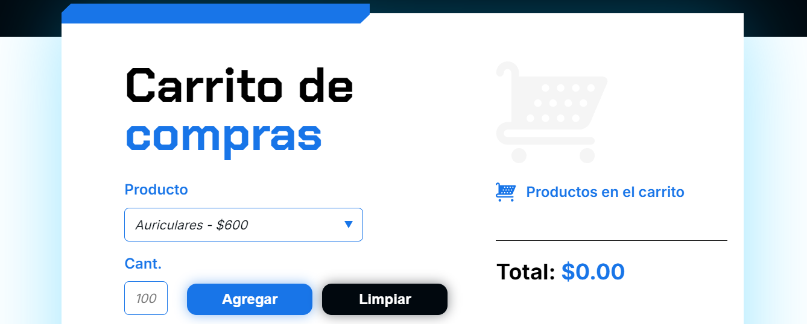

# 🛒 Carrito de Compras

**Carrito de Compras** es una aplicación web simple y funcional que permite a los usuarios seleccionar productos, establecer cantidades y visualizar un desglose detallado de los productos agregados al carrito junto con el precio total. Todo esto se implementó utilizando **HTML**, **CSS** y **JavaScript**.

## 🚀 Características

- Interfaz intuitiva y fácil de usar.  
- Selección de productos predefinidos con precios configurados.  
- Cálculo dinámico del precio total en tiempo real al agregar productos.  
- Función para limpiar el carrito y reiniciar la aplicación.  
- Formateo automático del precio con separación de miles para una mejor legibilidad.  

## 📂 Estructura del Proyecto

El proyecto está organizado en los siguientes archivos:

- **`index.html`**: Contiene la estructura principal del contenido de la página.  
- **`style.css`**: Define el diseño y los estilos de la interfaz.  
- **`app.js`**: Implementa la lógica del carrito de compras, incluyendo las funciones para agregar productos y limpiar el carrito.  

## 📦 Tecnologías Utilizadas

- **HTML5**: Para la estructura y semántica del contenido.  
- **CSS3**: Para el diseño visual y los estilos.  
- **JavaScript (ES6)**: Para la lógica dinámica e interactividad de la aplicación.  

## 🖥️ Cómo Ejecutar el Proyecto

1. Clona este repositorio en tu máquina local.  
   ```bash
   git clone https://github.com/josecervera20/carrito-de-compras
   ```
2. Abre el archivo `index.html` en cualquier navegador web moderno.

## 📋 Instrucciones de Uso

1. Selecciona un producto del menú desplegable.  
2. Introduce la cantidad deseada en el campo correspondiente.  
3. Haz clic en el botón **Agregar** para añadir el producto al carrito.  
4. Repite los pasos para añadir más productos.  
5. Observa el precio total actualizado en tiempo real en la sección del carrito.  
6. Si deseas reiniciar el carrito, haz clic en el botón **Limpiar**.  

## 🌟 Capturas de Pantalla 

  
*Ejemplo de cómo se ve el carrito de compras.* 

## 🤝 Contribuciones

Las contribuciones son bienvenidas. Si tienes ideas o mejoras, no dudes en abrir un _issue_ o enviar un _pull request_.  

## 📄 Licencia

Este proyecto está bajo la Licencia MIT. Puedes consultarla en el archivo [LICENSE](LICENSE).